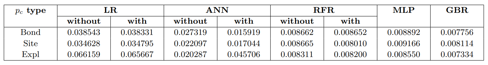

# PercolationThreshold
Machine Learning Models for Percolation Threshold prediction in network science

## Abstract
Percolation threshold is an important measure to determine the inherent rigidity of large networks. Predictors of the percolation threshold for large networks are computationally intense to run, hence it is a necessity to develop predictors of the percolation threshold of networks, that do not rely on numerical simulations. We demonstrate the efficacy of five machine learning-based regression techniques for the accurate prediction of the percolation threshold. The dataset generated to train the machine learning models contains a total of 777 real and synthetic networks and consists of 5 statistical and structural properties of networks as features and the numerically computed percolation threshold as the output attribute. We establish that the machine learning models outperform three existing empirical estimators of bond percolation threshold, and extend this experiment to predict site and explosive percolation. We also compare the performance of our models in predicting the percolation threshold and find that the gradient boosting regressor, multilayer perceptron and random forests regression models achieve the least RMSE values among the models utilized. 

## Objective
To develop a model to estimate percolation thrershold for complex networks, faster and with higher accuracy.

## Model Explanation

Here we are displaying the dataset composition for our experiments. For our machine learning models, we have used:
* Linear Regressor
* Random Forest Regressor
* Simple Artificial Neural Network (with one hidden layer)
* Multilayer Perceptron
* Gradient Bossting Regressor

## Results

## Conclusion and Future Plans
Our model outperforms existing statistical estimators of bond percolation threshold as described in the article. We have introduced these models for site and explosive percolation thresholds and have obtained siginificant results. 
Out of the five models, Gradient Boosting Regressor performs the best, followed by Multilayer Perceptron and Random Forest Rregressor.
